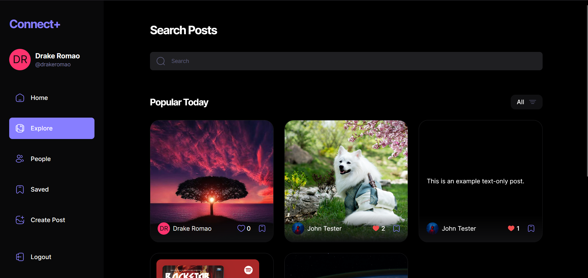
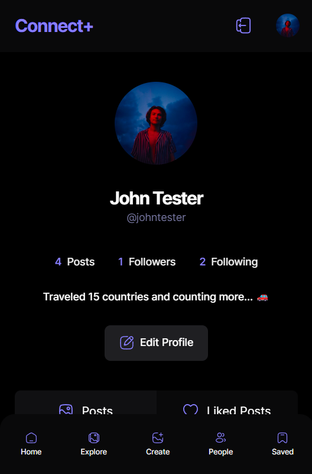

# Connect+ - Social Media App

Social media app where you can share your thoughts, images and/or music recommendations with others.

 
  
  

Made using React, TypeScript, Appwrite CLoud, Shadcn UI, Tailwind CSS

## Features📃
This is not just a regular social media app, it has extra features where a user can
- Generate Captions for posts using **AI**.
- Create post in form of text, image or music recommendation (using Spotify URL).
- Save posts to view them later.
- Follow other users and view their content.
- Search and explore all posts on the app
- Exclusive UI for mobile devices with mobile responsivenes.

## Preview

